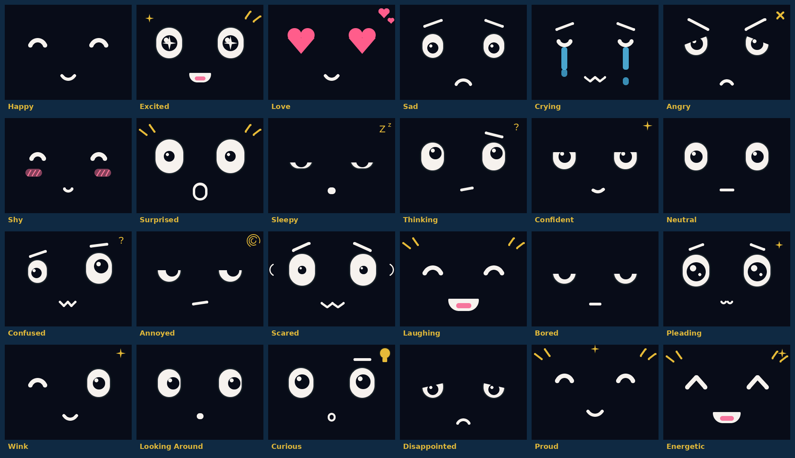

# Hiwar app for StackChan

Adds a **HIWAR** app to the official [M5Stack StackChan](https://github.com/m5stack/StackChan)
firmware (CoreS3, ESP-IDF v5.5.4). The rest of the firmware stays as it is.

## What the robot does

It works like a voice call:

1. Tap the screen or pat the head. The server returns a short-lived Gemini Live token for this one
   conversation (`/live/start {"mode": "auto"}`). The API key never leaves the server.
2. The robot opens a WebSocket straight to Gemini Live. It streams the microphone (16 kHz PCM) and
   plays Hiwar's voice (24 kHz PCM) the moment it arrives, so replies start within about a second.
3. Hiwar greets, asks how everyone is, replies, then asks: a family session or a personal one?
   Family: it asks an opening question and keeps the family talking (answers, reacts, follows up,
   invites quiet members in). Personal: a one-to-one chat, learning help, stories and games, or
   reflecting on the day. After 45 s of silence it offers something new, and only after several
   quiet spells in a row does it say goodbye. A call can last up to an hour.
   Hiwar's face follows the conversation: Gemini calls `express` (non-blocking, so speech isn't
   delayed) with one of 24 expressions and a head gesture (nod, shake, tilt). The face relaxes to
   neutral after a few seconds.
4. While Hiwar talks the microphone isn't sent (so it never hears itself). Tap while it talks to cut
   it short; tap while it listens to end the call. It also ends when the family says goodbye
   (Gemini calls `end_conversation`), after a long silence, or after an hour.
5. Every 8 s it sends numbers only (turns so far) to `/live/heartbeat`, so the dashboard shows the
   session live. At the end it sends `/evaluate_session` and nods. No rating step.

Gemini closes a Live connection every ~10 minutes; the robot reconnects and resumes the same
conversation with the handle Gemini gives it.

If Live can't start (for example the model name changed), the robot falls back to the older
turn-by-turn mode: one question (`/session_intro` + `/tts`), then each spoken turn is uploaded as
WAV to `/converse`. It works, but each reply takes several seconds.

## Hiwar's face

`app_sameer/hiwar_face.cpp` draws these with LVGL (no image files): glowing cream eyes with dark
pupils, closed-eye arcs, hearts, sparkles, tears, blush, brows and small gold symbols, all scaled
from one place (`Scale`). `hiwar_avatar.cpp` puts the face behind StackChan's `Avatar` interface,
so the stock blink, speaking and breathing modifiers still drive it. To preview changes without the
robot, render the face with LVGL on a PC (a 320×240 RGB565 canvas) and look at the images.

The RGB bar glows gold only while the microphone is listening. The camera is never used.

## Build

GitHub Actions builds it on every change under `firmware/`. Download **sameer-stackchan-firmware**
from the run's Artifacts. Optional repository settings:

- variable `SAMEER_SERVER_URL` (default `https://sameer-ai-agent-3.onrender.com`)
- secret `SAMEER_DEVICE_TOKEN`, matching `SAMEER_DEVICE_TOKEN` on the server

Locally, with ESP-IDF v5.5.4 on `PATH`: `firmware/build.sh` writes `firmware/build-sameer/sameer-stackchan.bin`.

## Flash

`sameer-stackchan.bin` is a single image for address `0x0`. In Chrome or Edge, open
<https://espressif.github.io/esptool-js/>, connect the StackChan over USB-C, and program the file at
`0x0`. **Do not erase the flash**, or the saved Wi-Fi settings are lost.

M5Stack's cloud features (StackChan World app, video calls) use keys that are not in the public
repository, so they don't work in this build. To go back to the factory firmware, use M5Burner.
